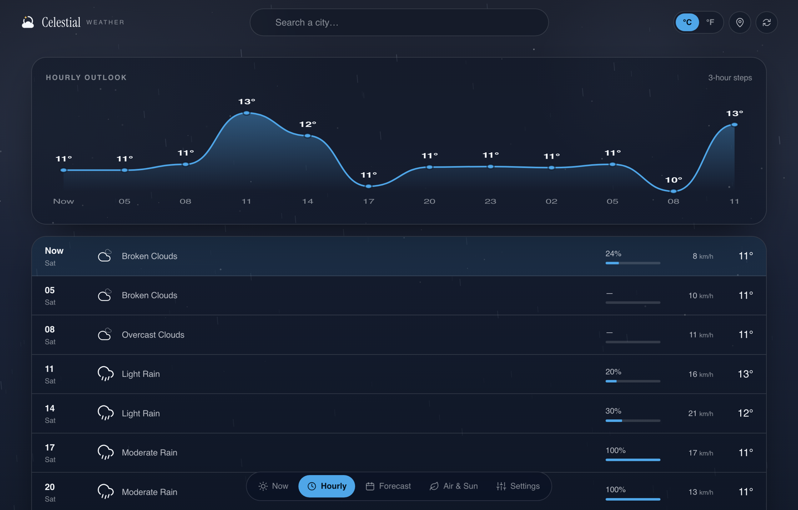

<div align="center">

# Celestial

**Weather under the sky you are actually looking at.**

[](https://celestialsky.vercel.app)
[](LICENSE)
[](https://react.dev)
[](https://www.typescriptlang.org)
[](https://vite.dev)

[**Open the app →**](https://celestialsky.vercel.app)


</div>

Most weather apps give you a table of numbers. Celestial renders the sky the chosen
city is under — gradient by local phase, stars, drifting cloud, rain, snow, lightning,
fog — and floats the readings on glass above it. The moon is real: it is carved to
tonight's actual phase, so a new moon gives off almost nothing.

The interface reads the sky too. Chrome contrast follows it, so a noon sky gets light
panels and midnight gets dark ones, and you can pin either in Settings.

## Try it

```
https://celestialsky.vercel.app/?q=Reykjavik
https://celestialsky.vercel.app/?q=Tokyo#/air
https://celestialsky.vercel.app/?q=Bergen#/hourly
```

`?q=` opens straight onto a city, and the address bar keeps up as you search, so any
view is linkable. Views live on the hash: `#/now`, `#/hourly`, `#/forecast`, `#/air`,
`#/settings`. Press `/` to jump to the search box.

| | |
|---|---|
|  |  |
| **Hourly** — a temperature curve over the next 36 hours | **Air & Sun** — air quality, daylight, and tonight's moon |

## What it shows

- **Now** — conditions, feels-like, humidity, wind with gusts and compass point, pressure against average, visibility, cloud cover, and a dew point derived from the reading
- **Hourly** — a smoothed temperature curve plus per-step precipitation odds and wind
- **Forecast** — five days, each with a range bar scaled across the whole week
- **Air & Sun** — AQI with the six pollutants, a daylight arc tracking the sun's position, and the moon's phase, illumination and place in the 29.5-day cycle
- **Settings** — °C/°F, chrome that follows the sky or stays put, recent searches, and a session API key

Temperatures are always fetched in metric and converted in the browser, so switching
units costs no request. Every time is rendered in the *searched city's* local time,
not yours.

## The API key never reaches the browser

Requests go to `/api/weather`, and the serverless function attaches the key from an
environment variable. It is not an open proxy: five upstream endpoints are reachable
by a `resource` name and exactly six query parameters are forwarded — anything else,
including a client-supplied `appid`, is dropped. Successful responses carry
`s-maxage=600` so the edge absorbs repeat traffic; errors are never cached.

**Deploying your own:** set `OPENWEATHER_API_KEY` in your Vercel project settings and
redeploy. That is the whole setup.

**Without a proxy:** put a key in `VITE_OPENWEATHER_API_KEY`, or paste one into the
app's setup panel — that one is held in memory for the session and never stored. A key
supplied either way overrides the proxy, and is visible to anyone who views source, so
do not ship one that way publicly.

Keys are free at [openweathermap.org/api](https://openweathermap.org/api) and take up
to two hours to activate.

## Run it

```bash
npm install
npm run dev        # http://localhost:4180
npm run build      # typecheck, then bundle to dist/
npm run typecheck
```

`npm run dev` serves the client only. To exercise the serverless function as well:

```bash
OPENWEATHER_API_KEY=your-key npx vercel dev
```

Without a proxy the app notices and asks for a key rather than failing silently.

## How it is put together

| Path | Responsibility |
| --- | --- |
| `api/weather.js` | Serverless proxy; holds the key, allowlists upstreams and params |
| `src/lib/config.ts` | Proxy-versus-direct mode, endpoints, tunables |
| `src/lib/api.ts` | Every `fetch`; timeouts, aborts, human-readable error mapping |
| `src/lib/transform.ts` | Raw payloads → flat view models (pure functions) |
| `src/lib/format.ts` | Units, timezone-aware dates, compass points, relative time |
| `src/lib/sky.ts` | Condition code + local hour → sky palette and particle layers |
| `src/lib/moon.ts` | Lunar phase from the clock; needs no API data |
| `src/components/SkyCanvas.tsx` | The animated sky: one canvas, one loop |
| `src/app/store.tsx` | All state, and the only place that calls the API |
| `src/app/router.tsx` | Hash routing, hand-rolled — five static routes |

Data flows one way: `api → transform → ui`. The view layer never fetches; `api.ts` and
`transform.ts` never touch the DOM. That split is why the rewrite from vanilla JS to
React replaced only the views — the three pure layers ported across with types added.

## Endpoints

Named by the `resource` the client sends to the proxy:

| `resource` | Upstream | Purpose |
| --- | --- | --- |
| `geocode` | `/geo/1.0/direct` | city name → coordinates |
| `reverse` | `/geo/1.0/reverse` | coordinates → place name, for geolocation |
| `current` | `/data/2.5/weather` | current conditions |
| `forecast` | `/data/2.5/forecast` | 5 days in 3-hour steps; feeds hourly *and* daily |
| `air` | `/data/2.5/air_pollution` | air quality; optional, never blocks the page |

## Worth knowing

- **Hourly steps are three hours apart.** That is the free tier's resolution; true
  per-hour data needs the paid One Call plan.
- **Recent searches are memory-only** and clear on reload, by design. Unit and chrome
  preference are the only things stored.
- **Auto-refresh** every 10 minutes while the tab is visible, plus a catch-up when you
  return to a stale tab. A failed background refresh keeps the last good reading rather
  than blanking the page.
- **Reduced motion** is honoured: the sky paints a single static frame.
- **Moon phase** uses the mean synodic approximation — a few hours' drift at worst,
  well below the resolution of "waning crescent, 11% lit".

## License

[MIT](LICENSE) — do what you like with it.
