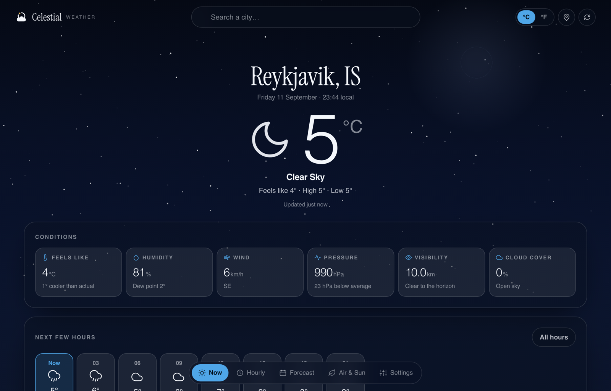
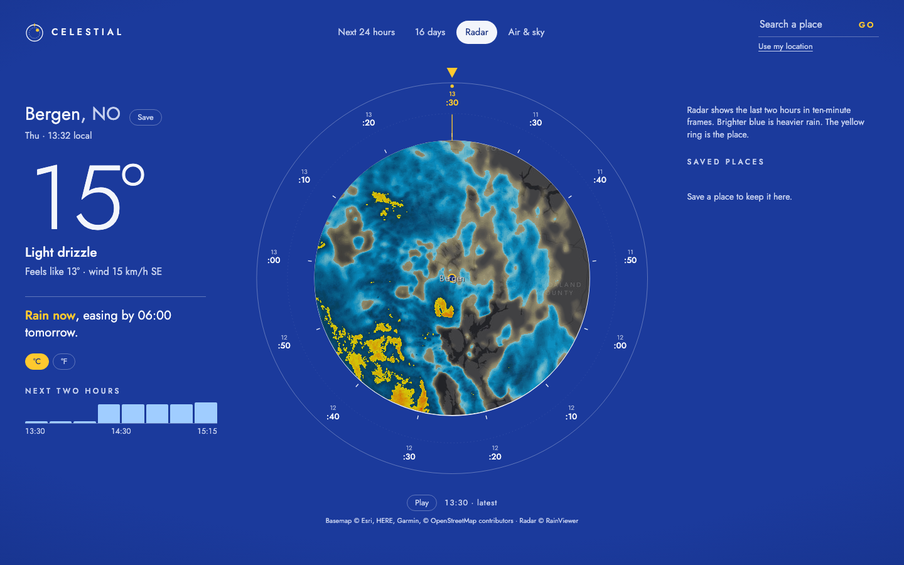
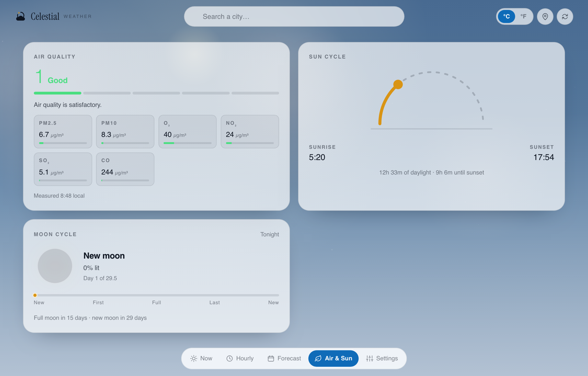

<div align="center">


# Celestial

**The real sky over any place, on a star wheel you turn.**

[](https://celestialsky.vercel.app)
[](LICENSE)
[](https://react.dev)
[](https://www.typescriptlang.org)

[**Open the app →**](https://celestialsky.vercel.app)



</div>

Celestial is a weather app built like a planisphere. In the middle is a round window onto the
sky over the place you searched — the sun, the moon at its actual phase, the brightest stars
where they really are, today's sun path, and the cloud and rain the forecast expects. Around it
is a printed rim. Turn it, and the window shows the sky at that moment.

Nothing in the window is decoration. Every position is computed from the date and the
coordinates; every veil of cloud and streak of rain is that hour's forecast.

## Four wheels

| View | The window shows | The rim holds |
|---|---|---|
| **Next 24 hours** | the sky at the chosen hour | each hour's temperature, with a rain spoke whose length is the amount |
| **16 days** | each day's noon sky and cloud | sixteen days: high, low and rain total |
| **Radar** | rain radar, clipped to the round window | the last two hours in ten-minute frames |
| **Air & sky** | the sky now, stars and all | the coming lunar month; each spoke is how much of the moon is lit |

Beside the wheel: the temperature, and one line that answers the question you opened the app
for — *"Dry until 18:00, then light rain"*, *"Rain now, easing by 06:00 tomorrow"* — with a
rain timeline for the next two hours in fifteen-minute steps.

| | |
|---|---|
|  |  |
| **Radar** — Bergen's rain, frames on the rim | **Air & sky** — the moon's month, air quality, sun and moon |

## Try it

```
https://celestialsky.vercel.app/?q=Reykjavik
https://celestialsky.vercel.app/?q=Tokyo#/air
https://celestialsky.vercel.app/?q=Bergen&t=6#/now
```

Every state is a link: `?q=` names the place (or `?at=lat,lon`), the hash picks the view, and
`t` is the position of the wheel. Press `/` to search. Drag the rim, scroll over it, or use the
arrow keys; `Home` and `End` jump to either end.

It also **installs** as an app, and keeps the last forecast for each place you've opened, so it
still answers with no connection (it says *"as of 20:15"* when it does). Save the places you
check; their temperatures arrive in a single request.

## How it works

No backend and no API keys. Forecasts, air quality and place search come straight from
[Open-Meteo](https://open-meteo.com); radar frames from [RainViewer](https://www.rainviewer.com).

| Path | What it does |
| --- | --- |
| `src/lib/astro.ts` | Sun, moon and star positions; moon phase by ecliptic elongation; next full/new moon; polar day and night |
| `src/lib/openmeteo.ts` | Requests and parsing. Hour labels come from the API's local wall-clock strings, so DST and odd offsets (+05:45, −10:00) stay right |
| `src/lib/outlook.ts` | The one-line answer |
| `src/lib/columns.ts` | Hours and days → what the rim and window need |
| `src/lib/url.ts`, `places.ts` | Every view as a URL; settings and saved places on the device |
| `src/dial/Dial.tsx` | The rim: an SVG wheel you can drag, scroll or step through |
| `src/dial/SkyWindow.tsx` | The window: the sky drawn on a canvas in azimuthal projection, east on the left as you'd see it looking up |
| `src/views/` | The four wheels; Radar (Leaflet) and Air load only when opened |

The astronomy uses the SunCalc formulas with the main periodic lunar terms from Meeus, which puts
full and new moons within about two hours of the published times. The tests check it against
real events: the solstice sun over Greenwich, the full and new moons of January 2025, Polaris
at the observer's latitude, and polar night in Tromsø.

## Run it

```bash
npm install
npm run dev        # http://localhost:4180
npm test           # unit tests (Vitest)
npm run typecheck
npm run build && npm run preview
npm run smoke      # with the preview running: three places, desktop and phone, offline, saved places
```

Needs Node 20 or newer. No environment variables.

## Credits

Weather and air quality: [Open-Meteo](https://open-meteo.com) (CC BY 4.0). Radar:
[RainViewer](https://www.rainviewer.com). Radar basemap: Esri, HERE, Garmin, © OpenStreetMap
contributors. Typeface: [Jost](https://fonts.google.com/specimen/Jost) (OFL).

## License

[MIT](LICENSE)
